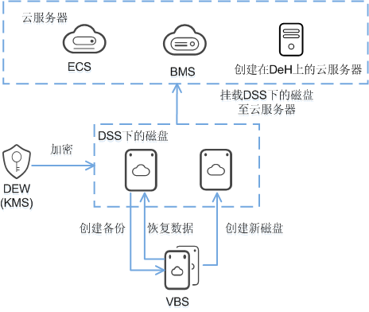

# 专属分布式存储服务与其他服务的关系

-   弹性云服务器（ECS，Elastic Cloud Server）：专属分布式存储的磁盘可以挂载至弹性云服务器，提供可弹性扩展的块存储设备。
-   裸金属服务器（BMS，Bare Metal Server）：专属分布式存储的SCSI类型的磁盘可以挂载至裸金属服务器，提供可弹性扩展的块存储设备。
-   云硬盘备份（VBS，Volume Backup Service）：通过云硬盘备份服务可以备份专属分布式存储中的磁盘数据，保证云服务器数据的可靠性和安全性。
-   数据加密服务（DEW，Data Encryption Workshop）：专属分布式存储的磁盘加密功能依赖于数据加密服务中的密钥管理功能（KMS）。您可以使用密钥管理功能提供的密钥来加密磁盘，包括系统盘和数据盘，从而提升磁盘中数据的安全性。
-   专属主机（DeH，Dedicated Host）：专属分布式存储的磁盘可以挂载至专属主机上创建的云服务器上，提供可弹性扩展的块存储设备。

专属分布式存储服务与其他服务之间的关系如[图1](#fig1088641814289)所示。

**图 1**  专属分布式存储服务与其他服务的关系示意图  

