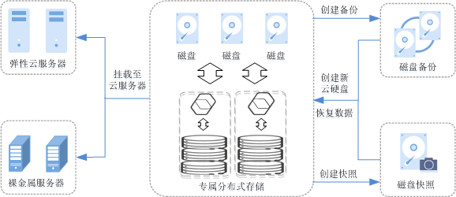

# 什么是专属分布式存储服务

专属分布式存储服务（Dedicated Distributed Storage Service，DSS）为您提供独享的物理存储资源，通过数据冗余和缓存加速等多项技术，提供高可用性和持久性，以及稳定的低时延性能；可灵活对接ECS、BMS以及DCC等多种不同类型的计算服务，适用于HPC、OLAP以及混合负载等应用场景。

**图 1**  专属分布式存储架构图  

## 功能特点

-   规格丰富
    -   高IO专属分布式存储：高性能、高扩展、高可靠，适用于性能相对较高，读写速率要求高，有实时数据存储需求的应用场景。
    -   超高IO专属分布式存储：低时延、高性能，适用于低时延，高读写速率要求，数据密集型应用场景。

-   弹性扩展
    -   按需扩容：可根据业务需求扩容存储池。
    -   性能线性增长：支持在线扩容DSS下的磁盘，并且性能线性增长，满足业务需求。

-   安全可靠
    -   三副本冗余：数据持久性高达99.9999999%。
    -   数据加密：系统盘和数据盘均支持数据加密，保护数据安全。

-   备份恢复
    -   磁盘备份：可为DSS下的磁盘创建备份，利用备份数据回滚磁盘，最大限度保障您数据的安全性和正确性，确保业务安全。
    -   云服务器备份：可为云服务器创建备份，利用备份数据恢复云服务器业务数据，最大限度保障您数据的安全性和正确性，确保业务安全。

## 专属分布式存储服务与云硬盘服务的区别

**表 1**  DSS与EVS的区别

<table><thead align="left"><tr id="row3948102845519"><th class="cellrowborder" valign="top" width="18.627450980392158%" id="mcps1.2.6.1.1">
<strong id="b12437491008">服务名称</strong>

</th>
<th class="cellrowborder" valign="top" width="20.588235294117645%" id="mcps1.2.6.1.2">
<strong id="b024316491011">总体介绍</strong>

</th>
<th class="cellrowborder" valign="top" width="17.64705882352941%" id="mcps1.2.6.1.3">
存储类别

</th>
<th class="cellrowborder" valign="top" width="21.568627450980394%" id="mcps1.2.6.1.4">
典型应用场景

</th>
<th class="cellrowborder" valign="top" width="21.568627450980394%" id="mcps1.2.6.1.5">
性能规格

</th>
</tr>
</thead>
<tbody><tr id="row4948162855511"><td class="cellrowborder" valign="top" width="18.627450980392158%" headers="mcps1.2.6.1.1 ">
专属分布式存储服务

</td>
<td class="cellrowborder" valign="top" width="20.588235294117645%" headers="mcps1.2.6.1.2 ">
专属分布式存储服务为用户提供独享的物理存储资源，存储池资源物理隔离，数据持久性高达99.9999999%，可同时对接多种不同类型的计算服务，如ECS、BMS、DCC等，功能丰富、安全可靠。

</td>
<td class="cellrowborder" valign="top" width="17.64705882352941%" headers="mcps1.2.6.1.3 ">
存储池物理隔离，资源独享，专属存储。

</td>
<td class="cellrowborder" valign="top" width="21.568627450980394%" headers="mcps1.2.6.1.4 "><ul id="ul1687232518370"><li>对接专属云中的ECS、BMS等计算服务</li><li>对接非专属云中的ECS、BMS等计算服务</li><li>混合负载，专属分布式存储可同时支持HPC、数据库、Email、OA办公、Web等多个应用混合部署</li><li>高性能计算</li><li>OLAP应用</li></ul>
</td>
<td class="cellrowborder" valign="top" width="21.568627450980394%" headers="mcps1.2.6.1.5 "><ul id="ul623744231518"><li>高IO：起步规格16TB，扩容步长16TB，最大可扩容至512TB，最大IOPS为1500 IOPS/TB。</li><li>超高IO：起步规格8.5TB，扩容步长8.5TB，最大可扩容至340TB，最大IOPS为8000 IOPS/TB。</li></ul>
</td>
</tr>
<tr id="row139482281550"><td class="cellrowborder" valign="top" width="18.627450980392158%" headers="mcps1.2.6.1.1 ">
云硬盘

</td>
<td class="cellrowborder" valign="top" width="20.588235294117645%" headers="mcps1.2.6.1.2 ">
云硬盘可以为云服务器提供高可靠、高性能、规格丰富并且可弹性扩展的块存储服务。

</td>
<td class="cellrowborder" valign="top" width="17.64705882352941%" headers="mcps1.2.6.1.3 ">
共享存储池资源

</td>
<td class="cellrowborder" valign="top" width="21.568627450980394%" headers="mcps1.2.6.1.4 "><ul id="ul1469585719317"><li>企业日常办公应用</li><li>开发测试</li><li>企业应用，例如SAP、Microsoft Exchange和Microsoft SharePoint等</li><li>分布式文件系统</li><li>各类数据库，例如：MongoDB、Oracle、SQL Server、MySQL和PostgreSQL等</li></ul>
</td>
<td class="cellrowborder" valign="top" width="21.568627450980394%" headers="mcps1.2.6.1.5 ">
云硬盘支持按需扩容，最小扩容步长为1GB，单个云硬盘可由10GB扩展至32TB。

</td>
</tr>
</tbody>
</table>

**图 2**  DSS与EVS的区别  

