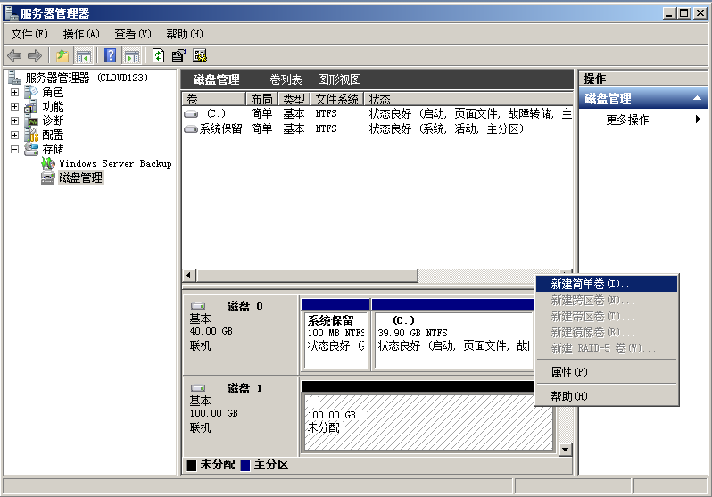
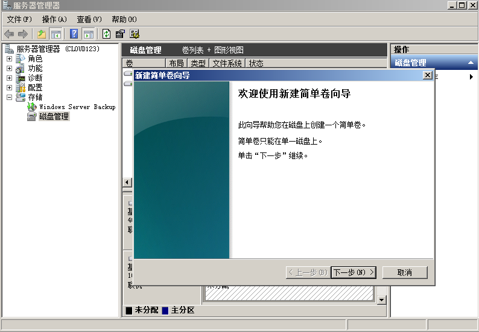
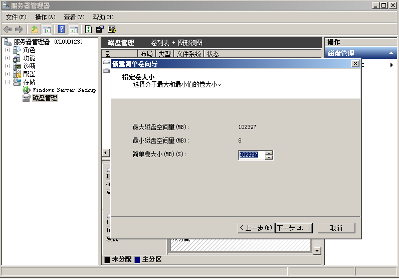
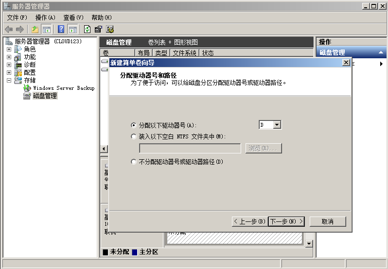
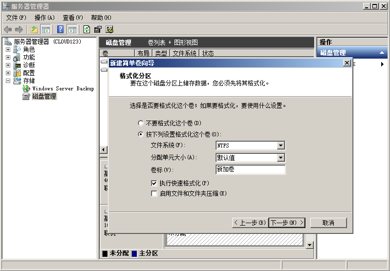
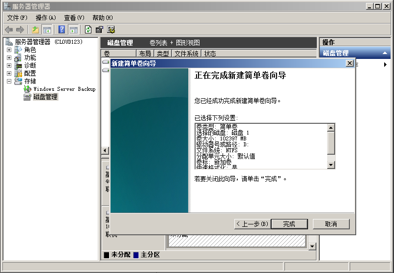
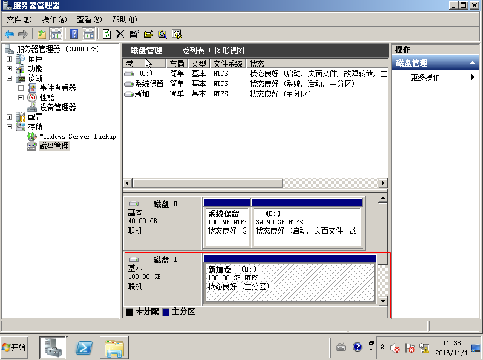

# 初始化Windows数据盘

## 操作须知

本文以云服务器的操作系统为“Windows Server 2008 R2 Enterprise ”为例，不同云服务器的操作系统的初始化操作和界面可能不同，本文仅供参考，具体操作步骤和差异请参考云服务器的操作系统的产品文档。

> **注意：**   
>不同文件系统支持的分区个数和分区大小不同，请根据您的业务需求选择合适的文件系统。  

以下场景，需登录云服务器初始化磁盘后，磁盘才能正常使用。

-   创建云服务器时添加了数据盘，待云服务器创建完成后，需要初始化数据盘。
-   云服务器新绑定磁盘后，需初始化新磁盘。

## 前提条件

-   已登录云服务器。

    弹性云服务器请参见《弹性云服务器用户指南》中章节“登录弹性云服务器”。

-   已挂载数据盘至云服务器，且该数据盘未初始化。

## 操作步骤

1.  在云服务器桌面，选择“开始”，右键单击“计算机”，选择“管理”。

    弹出“服务器管理器”窗口。

2.  在左侧导航树中，选择“存储 \> 磁盘管理”。

    进入“磁盘管理”页面。

3.  在右侧窗格中出现磁盘列表，若新增磁盘处于脱机状态，请先联机。

    联机后，单击右键在菜单列表中选择“初始化磁盘”。

4.  在“初始化磁盘”对话框中显示需要初始化的磁盘，选中“MBR（主启动记录）”，单击“确定”，如[图1](#fig51209068112252)所示。

    **图 1**  初始化磁盘  
    

5.  右键单击磁盘上未分配的区域，选择“新建简单卷”，如[图2](#fig8222462112252)所示。

    **图 2**  新建简单卷  
    

6.  弹出“新建简单卷向导”对话框，根据界面提示，单击“下一步”，如[图3](#fig62637499112252)所示。

    **图 3**  新建简单卷向导  
    

7.  根据需要指定卷大小，默认为最大值，单击“下一步”，如[图4](#fig43805274112252)所示。

    **图 4**  指定卷大小  
    

8.  分配驱动器号，单击“下一步”，如[图5](#fig13573293112252)所示。

    **图 5**  分配驱动器号和路径  
    

9.  勾选“按下列设置格式化这个卷”，并根据实际情况设置参数，格式化新分区，如[图6](#fig33550467114121)所示。

    **图 6**  格式化分区  
    

10. 单击“下一步”，完成分区创建，如[图7](#fig19942051114314)所示。

    **图 7**  完成分区创建  
    

11. 单击“完成”，完成向导，您需要等待片刻让系统完成初始化操作，当卷状态为“状态良好”时，表示初始化磁盘成功，如[图8](#fig7558255112252)所示。

    **图 8**  初始化磁盘成功  
    

