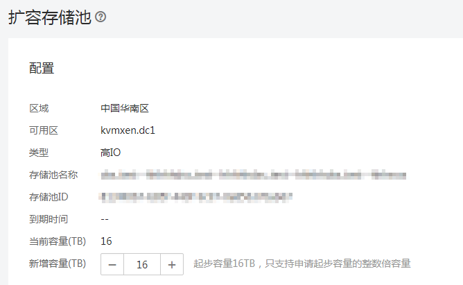

# 扩容存储池

## 操作场景

当存储池空间不足时，需要对原有存储池进行扩容。

## 操作步骤

1.  登录管理控制台。
2.  选择“专属分布式存储 \> 存储池”。在存储池列表选择需要进行扩容的存储池，在“操作”栏下点击“扩容”，进入“扩容存储池”页面，如[图1](#fig156181036162616)所示。

    **图 1**  扩容存储池  
    

3.  根据页面提示设置“新增容量\(GB\)”参数，设置完成后，单击“提交”。
4.  在“订单详情”页面，您可以再次核对扩容信息。
    -   确认无误后，单击“提交申请”创建订单，根据页面提示进行后续操作。
    -   如果还需要修改，单击“上一页”，修改参数。

5.  对审批过的订单支付后，在“专属分布式存储服务”主页面，查看存储池状态。
    -   若状态为“正在扩容”，表示订单已处理完毕，存储资源正在实施扩容操作。
    -   待专属分布式存储状态变为“可用”时，表示专属分布式存储已部署成功。

